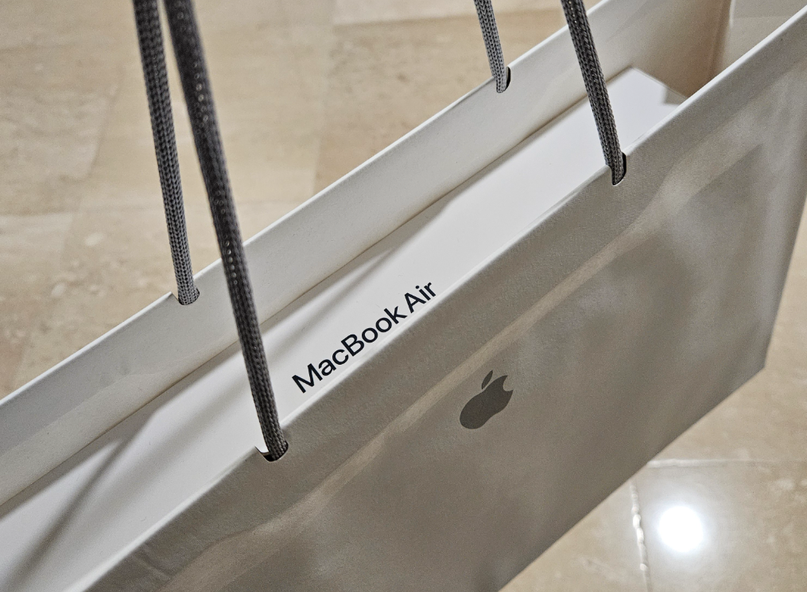
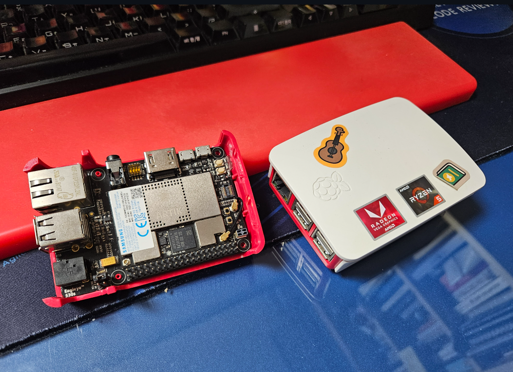
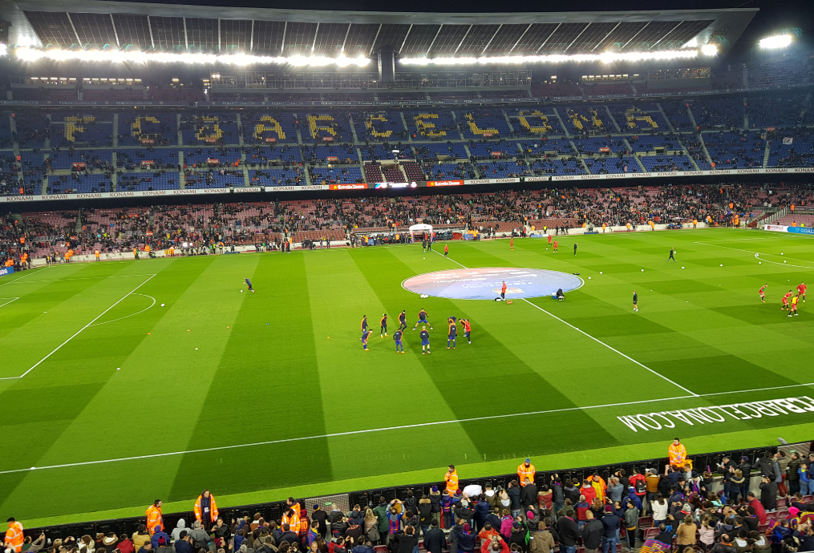
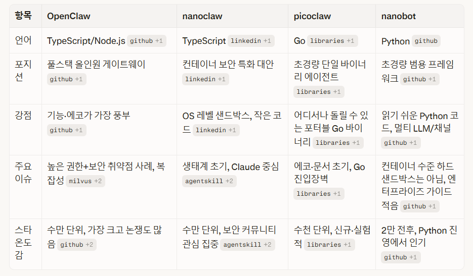
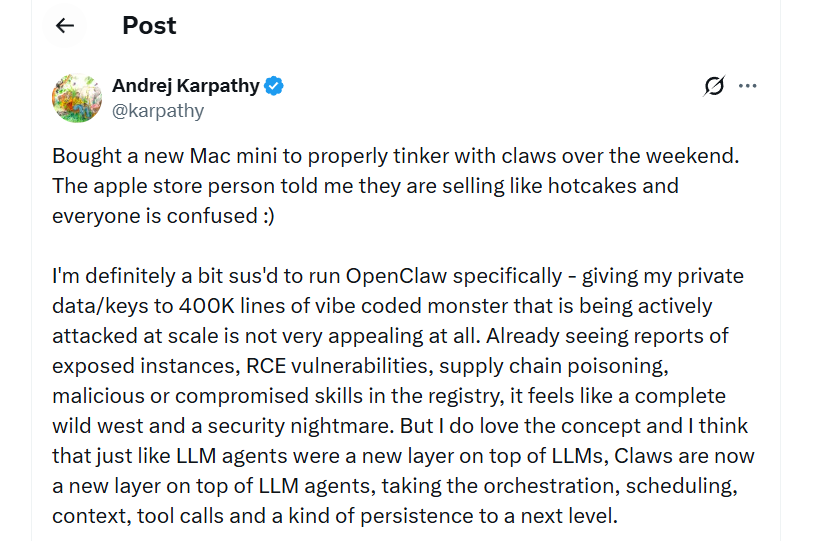

## OpenClaw 핑계로 맥북 구매

OpenClaw가 맥미니를 품절시켰다. 그 뉴스를 보고 맥북이 참 혜자스러운 가격이라는 것을 알게되어서 바로 지르게되었다.

사실 오래전부터 해보고 싶었던 것이 iOS 앱 개발이었다. 앱 검수가 까다롭기로 유명한데, 나의 앱 철학이 승인받을 수 있을지 궁금하기도 했고, 무엇보다 시장의 크기가 매력적이기 때문이다.

그럼에도 불구하고 망설였던 것은 시간이 부족했던 것도 있지만, 추가 몇가지 허들이 있는데, 매년 $99씩 등록비를 내야 계정을 유지할 수 있고, 맥북이 필요하다는 것이다.

여러가지 이유를 만들어서 맥북 에어를 바로 질렀다. 마침 대학생 할인까지 해서, 나이스 타이밍~

- 메모리 가격에 비하면 상대적으로 가성비임
- 애플 실리콘을 사용한 저전력 설계로 24시간 봇 운영에 적합
- iOS 앱 개발 기회 창출

## 라즈베리파이

Samsung Research 에서 Tizen IoT 업무를 할 때, 쟁여놓은 라즈베리파이 3B+ 보드가 있다는 사실을 떠올려서 보물 상자를 뒤적였다. 추억의 Artik 보드도 있다.

그때 DS부문과 인연으로 MWC 2018에 참석했던 추억이 떠오른다. 낯에 MCW 관람하고 저녁에 메시보고, 짬내서 지역 조사했던 행복한 날들...

맥북에 OpenClaw를 올리기보다는 라즈베리파이부터 시작해보면 좋겠다. 라즈베리파이에서 [smtm](https://smtm.msalt.net/) 돌려서 자동매매도 문제 없었으니, 가능할 듯.

## OpenClaw, NanoClaw, nanobot

뭘 써야 하나 고민하다가 nanobot을 사용하기로 했다.

- **openclaw**: 기능은 풍부하지만 라즈베리 파이에 올리기엔 너무 무거웠다. 메모리를 많이 잡아먹는다는 후기가 많았다.
- **nanoclaw**: 이름처럼 가볍긴 했지만 문서가 부족해서 처음 시작하기가 어려웠다.
- **picoclaw**: 흥미로운 프로젝트였지만 커뮤니티가 작고 업데이트가 뜸했다.

결국 **nanobot**을 선택했다. 이유는 몇 가지였다.

1. 가볍다 - 라즈베리 파이의 제한된 리소스에서도 잘 돌아간다
2. Python 기반이라 커스터마이징이 쉽다

완벽한 선택이라고 할 수는 없지만, 일단 시작하기에는 충분했다. 무엇보다 코드가 작은 것이 마음에 들었다.

나는 카파시와 비슷한 생각인데, 40만 라인의 오픈소스 프로그램에 내 토큰이랑 권한을 다 넘기는 것은 차마 할 수가 없다. 나는 아직 바이브 코딩을 하면서도 대충이라도 코드 리뷰를 꼭 하고 나서 직접 커밋을 하는 늙은이라서 그런가보다.

https://x.com/karpathy/status/2024987174077432126

카파시 이야기가 나와서, 카파시의 영상하나 투척하고 빠이~

<iframe width="560" height="315" src="https://www.youtube.com/embed/zjkBMFhNj_g?si=8sFwQdTF8qYZQvnF" title="YouTube video player" frameborder="0" allow="accelerometer; autoplay; clipboard-write; encrypted-media; gyroscope; picture-in-picture; web-share" referrerpolicy="strict-origin-when-cross-origin" allowfullscreen></iframe>
