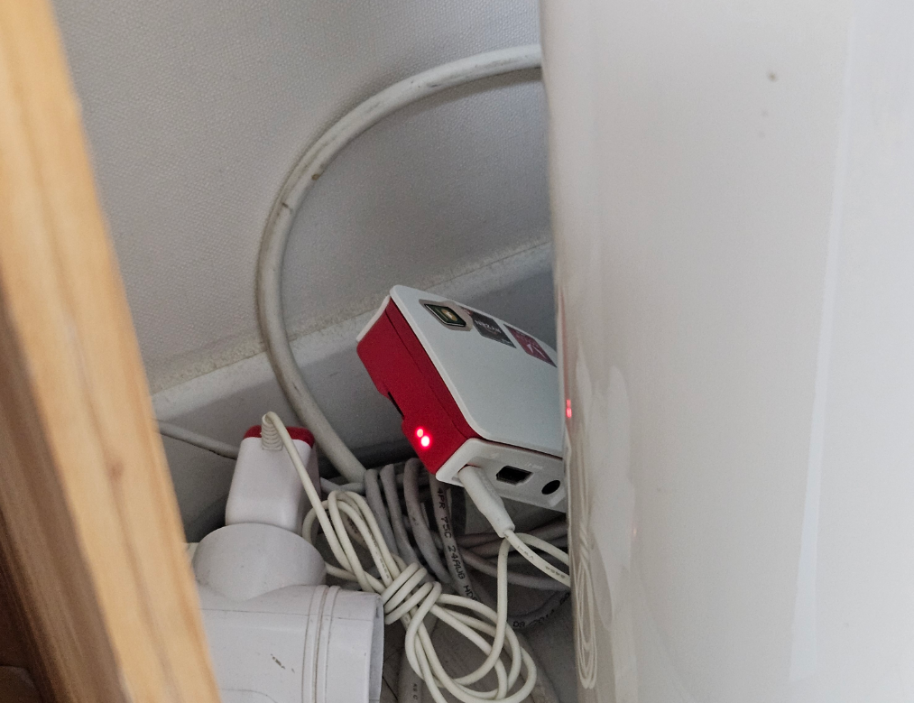

## Ubuntu 22.04 설치

라즈베리 파이 이미저(Raspberry Pi Imager)를 이용해서 SD 카드에 Ubuntu 22.04 LTS를 구우려고 했는데, 다행이 이전에 셋업해 놓은걸로 접속이 잘 되어서. 20.04에서 22.04로 업그레이드만했다.



예전에는 IoT 관련 정보는 많이 없고, 잘 못된 것이 많아서 검색해서 알음알음 Rpi에 이미지 굽고, 거기다가 패키지 설치하고 ssh 연결까지 끝내는 것도 일이었는데 요즘엔 그런 정보도 인공지능이 완전 잘 찾아준다. 정말...구글 검색 빈도가 확 줄었다. 반면 네이버 검색은 줄일 수가 없다. 맛집이나 레시피, 후기 등을 주로 네이버에서 검색하는데 그런 정보는 정확한 내용이 중요한게 아니다. 답도 없을 뿐만 아니라 이미지나 글쓴이의 뉘앙스까지도 중요한 정보이기 때문이다. 정말 네이버는 보물을 가지고 있는데, 왜 사람들은 네이버의 가치를 몰라주나...~~네이버 주주라서 그런건...~~

## Python 3.11 업그레이드

Ubuntu 22.04에는 기본으로 Python 3.10이 설치되어 있다. nanobot이 Python 3.11 이상을 권장하기 때문에 업그레이드가 필요했다. 이런 정보를 찾기위해서 블로그를 돌아 다닐 일이 없어졌다는 것이다.

### deadsnakes PPA 사용

```bash
sudo add-apt-repository ppa:deadsnakes/ppa
sudo apt update
sudo apt install python3.11 python3.11-venv python3.11-dev -y
```

### 기본 Python 버전 설정

```bash
sudo update-alternatives --install /usr/bin/python3 python3 /usr/bin/python3.10 1
sudo update-alternatives --install /usr/bin/python3 python3 /usr/bin/python3.11 2
sudo update-alternatives --config python3
```

`sudo update-alternatives --config python3`를 실행하면 어떤 버전을 기본으로 쓸지 선택하는 메뉴가 나온다. `2`를 선택해서 3.11을 기본으로 설정했다.

확인:

```bash
python3 --version
# Python 3.11.x
```

## nanobot 설치

Python 환경이 준비됐으니 nanobot을 설치할 차례다. 소스코드를 받아서 사용해도 되는데, 어떻게 할까 고민하다가 그냥 pip로 패키지 설치했다.

```bash
mkdir ~/nanobot-assistant
cd ~/nanobot-assistant
python3 -m venv .venv
source .venv/bin/activate
pip install nanobot
```

설치가 완료되면 버전 확인:

```bash
nanobot --version
```


폰에서 봇에게 메시지를 보내고 답장을 받는 것, 그 단순한 것부터 시작하기로 했다.
