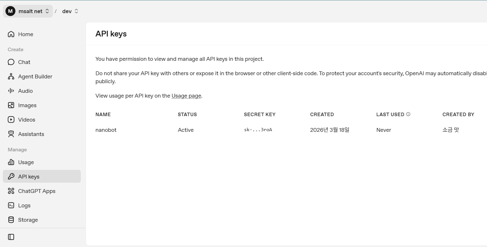
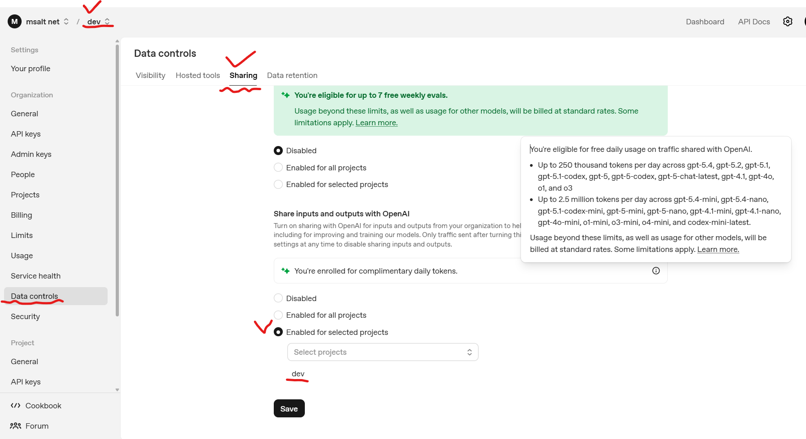
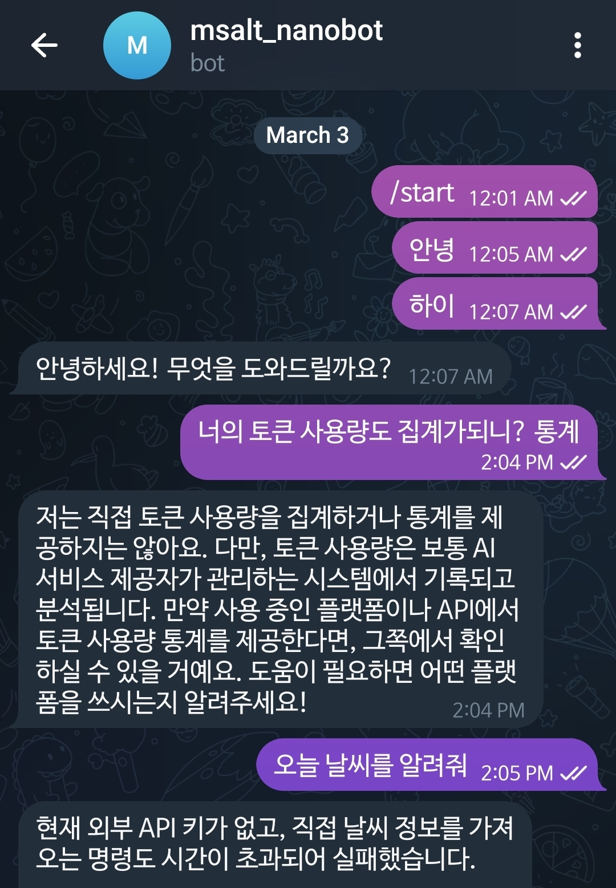

## 왜 Telegram인가

- 봇 API가 무료이고 잘 문서화되어 있다
- 라즈베리 파이에서도 가볍게 돌아간다
- BotFather를 통해 몇 분 만에 봇 토큰을 발급받을 수 있다

이런 이유와 무관하게 나는 그냥 텔레그램을 좋아한다. 내가 쓴 책 [암호화폐 자동매매 시스템 만들기 with 파이썬](https://product.kyobobook.co.kr/detail/S000001624720)에도 왜 텔레그램을 사용해야 하는지 구구절절 적어놨다ㅋ

내가 텔레그램을 사용한건 텔레그램에 봇 기능이 도입되기 전부터였다. 텔레그램 자체도 좋지만 봇기능은 완전 무료에 사용법도, 기술도 정말 매력적이었고, 아직까지도 더 없이 훌륭하다. 광고하나 없이 무료로 말이다. 

[텔레그램telegram 봇bot 사용법 소개 및 후기](https://blog.msalt.net/112) - 많은 사람들에게 소개해주고 싶은 마음에 적은 블로그 글인데 벌써 11년이...

텔레그램이 마약이나 불법 자금, 정치인들 뒷 이야기에 사용되다보니 무슨 다크웹 같은 것으로 생각하는 사람도 많은데, 애초에 푸틴한테 탄압 받아 자국을 떠난 vk메신저 창업자가 무료로 운영하고 있는 혜자 개념 프로젝트다.

## nanobot에 Telegram 연결

우선, BotFather로 봇 토큰 발급이 필요하다. 텔레그램은 Bot 등록 조차 텔레그램으로 처리하는데, 토큰 받는 것이 10년 전이랑 똑같다.ㅋㅋㅋ 애초에 얼마나 설계를 잘했는지, 감동...API 개발 문서, 발급 시스템에 빡쳐본 경험이 있는 개발자라면 누구나 감탄할 수밖에 없다. 정식 VoC 창구하나 없지만 비전공자도 어려움 없이 사용할 수 있게 만들어 놨다.

텔레그램에서 `@BotFather`를 검색해 대화를 시작하고, `/newbot`을 입력하면 된다. 봇 이름(표시 이름)을 먼저 물어보고, 그 다음에 username을 물어본다. username은 `_bot`으로 끝나야 한다는 규칙 하나만 지키면 끝. 그러면 바로 토큰을 발급해준다. 과정 자체가 챗봇 대화라 별도 웹사이트나 회원가입 같은 게 전혀 없다.

발급 받은 bot 토큰을 `~/.nanobot/config.json` 에 설정해준다.

```json
    "telegram": {
      "enabled": true,
      "token": "{받은 토큰}",
      "allowFrom": [],
      "proxy": null,
      "replyToMessage": false
    },
```

`allowFrom`은 명령을 허용할 사용자 ID

## LLM 연결 후 상견례

당연한 이야기지만 라즈베리파이는 LLM API를 사용해야 한다. OpenRouter 같은 서비스를 이용하면 deepseek 같은 모델을 싸게 이용할 수 있다.

나는 예전에 발급 받은 키를 사용해서 어렵지 않게 연결했다. 팁이 있다면, OpenAI의 경우 데이터 쉐어 프로그램이 있는데, 이 프로그램에 참여하면 하루에 일정량을 무료로 사용할 수 있다. $5 결제해 놨지만 실제로 차감된 적이 없다.



주의할 점이 있다면 input, output 데이터가 모두 OpenAI에 공유되기 때문에 개인 정보나 민감정보가 있는 경우 사용하지 않는 것이 좋고, Project를 따로 만들어서 개발욜 project에만 쉐어 프로그램에 참여하는 것도 방법이다. 일 250만 토큰이 제공되기 때문에 개발할 때 상당히 큰 도움이 된다.



API 키 역시 `~/.nanobot/config.json` 에 설정해준다.

```json
  "agents": {
    "defaults": {
      "workspace": "~/.nanobot/workspace",
      "model": "gpt-5.4-mini",
      "provider": "auto",
      "maxTokens": 8192,
      "temperature": 0.1,
      "maxToolIterations": 40,
      "memoryWindow": 100,
      "reasoningEffort": null
    }
```

주의할 점은 gpt-5.4 같은 경우 litellm에서 지원한지 얼마 안되어서, 자칫 이전 버전을 받으면 에러가 날 수 있다.



상견례를 했다. nanobot은 생각보다 많이 허접하다. 근데, 기능이야 뭐, 앞으로 내가 만들어 쓰면 된다는 생각이다. 관리되지 않는 다재다능함 보다 통제되는 무능함을 선택한 것이다. 뭐, 학습하기에도 딱 좋고, 개발자라면 맥미니 보다는 rpi 하나 사서 직접 agent 만들어서 돌리는 것도 한 번 고려해보면 좋을 듯. 물론, 충분히 예상되는 한계점이 있지만 지금까지는 괜찮다.ㅎ

다음은 tavily, brave를 붙이고 씨름한 이야기가 될듯ㅎ
